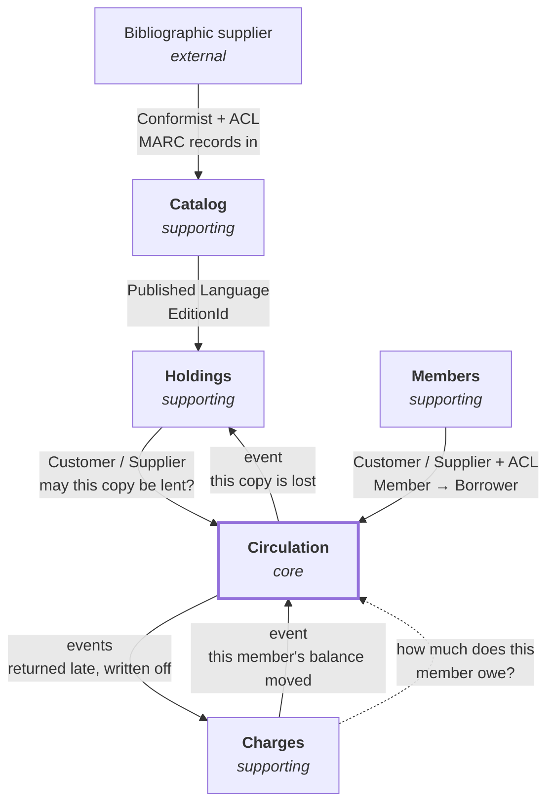

# LibraryManagement

A library management system for the staff of a single public library, built as a **modular monolith**
on .NET 10 — five DDD bounded contexts over a small technical shared kernel.

It is a showcase of architecture rather than of features. The goal is a codebase where every
structural decision is deliberate, argued somewhere, and enforced by something. Where a choice was
made, the document says what was rejected and why; where a decision is deferred, it names the trigger
that reopens it.

**It is design-first**: every context is decided on paper in [`docs/`](docs/) before it is coded, and
those documents are the authority. When the code and a document disagree, one of them is a bug and
the pair is fixed in the same change.

---

## State

All five bounded contexts are implemented and tested — Catalog, Holdings, Circulation, Members and
Charges — along with the passage that carries a fact from one module to another.

The one cycle the context map draws now turns both ways: Circulation announces a return or a loss,
Charges prices it, Charges announces the amount, and Circulation judges it against its own threshold
and cancels the borrower's holds.

**Deliberately absent, each for a recorded reason:**

| Missing | Why | Record |
|---|---|---|
| A runnable host | The composition root is the composition tests, which exercise the whole pipeline | [ADR-0013](docs/adr/0013-composition-root-in-the-tests.md) |
| EF migrations | A migration names a provider, and a module may not | [ADR-0010](docs/adr/0010-ensurecreated-before-migrations.md) |
| Notifications, Staff access | Generic subdomains, out of the modeled domain | [strategic design §6](docs/strategic-design.md) |
| MARC import | The Catalog's real feed; the manual commands are the fallback, not the design | [strategic design §6](docs/strategic-design.md) |

---

## The domain in four questions

Everything the system does exists to answer one of these:

- **What is this?** — the bibliographic description of a book, independent of any library → **Catalog**
- **What do we own, and where is it?** — this library's stock, its condition, its shelf → **Holdings**
- **Who has it, until when, and who is waiting?** → **Circulation** *(core)*
- **Who owes us what?** → **Charges**

The third is the one a library is *for*. The first two exist to make it answerable, and the fourth is
a consequence of it. **Members** answers who is entitled to borrow at all.

### The boundary test

One question decided most of the context map:

> **Can these two facts disagree for a few seconds without a librarian noticing something is wrong?**
>
> If **no**, they belong to the same context — the rule tying them is an invariant, and an invariant
> spanning two contexts is not enforced, only hoped for.
> If **yes**, they belong to different contexts — the rule is a convergence, and convergence is what
> messages between contexts are for.

Applied in both directions: **holds belong with loans** (a copy shelved that was promised is visible
at the desk, to the member), **fines do not** (a fine created two hundred milliseconds after a late
return is invisible to everyone).

### Context map



Solid arrows point downstream — at the context that must adapt when the other changes. Dashed arrows
are queries: they carry no authority and change nothing.

**An arrow out of the core announces and never instructs.** Circulation reports that a copy is
unaccounted for; that this makes it `Lost` is Holdings' rule, reached identically by a stocktake that
failed to find it. Nothing depends on *how Circulation decides* — the cap, the standing, the pickup
period — and those are the rules most likely to change.

The full map, including Notifications and the read model, is in
[`docs/strategic-design.md`](docs/strategic-design.md) §8.

---

## Architecture

| Concern | Approach |
|---|---|
| Deployment | Modular monolith — one process, one database, five modules ([ADR-0001](docs/adr/0001-modular-monolith-over-services.md)) |
| Layering | Clean Architecture — Domain / Application / Infrastructure per module |
| Modeling | DDD strategic + tactical — rich aggregates, value objects, domain events |
| Messaging in | CQRS over a source-generated mediator ([ADR-0005](docs/adr/0005-mediator-source-generator.md)) |
| Messaging out | Transactional outbox, one table per module ([ADR-0006](docs/adr/0006-transactional-outbox-per-module.md)) |
| Between modules | Published languages of primitives only ([ADR-0007](docs/adr/0007-published-language-only.md)) |
| Failure | `Result` for refusals, exceptions for faults ([ADR-0004](docs/adr/0004-result-over-exceptions.md)) |
| Persistence | Repository + unit of work; optimistic concurrency via `rowversion` |
| Enforcement | Executable architecture tests ([ADR-0011](docs/adr/0011-architecture-rules-are-tests.md)) |

### Module anatomy

Each bounded context is four projects:

```
LibraryManagement.<Module>.Domain             aggregates, value objects, domain events, repository
                                              interfaces, error codes
LibraryManagement.<Module>.Application        commands, handlers, validators, queries, DTOs
LibraryManagement.<Module>.Infrastructure     DbContext, EF configurations, repositories, query
                                              handlers, event translators, subscribers, DI
LibraryManagement.<Module>.PublishedLanguage  what this module says to the ones downstream of it —
                                              references nothing, primitives only
```

A module owns its `DbContext`, its schema, its domain model, its application layer and its
infrastructure. **No module references another's Domain, Application or Infrastructure** — only its
`PublishedLanguage`.

### Domain events and integration contracts are different things

They are never mixed, and the distinction is structural rather than stylistic.

**A domain event** stays inside its module. It carries the module's own types — `LoanId`, `CopyId`,
value objects that validate on creation — and is written to that module's outbox table in the *same
save* as the change that raised it. A scheduler drains the table and delivers each event later, in a
transaction of its own.

**An integration contract** crosses a boundary. It is a flat `record` of primitives in the publishing
module's `PublishedLanguage`, which references nothing at all — not even the shared kernel, so it
cannot implement a marker interface, so the mediator cannot carry this hop. Subscribers are resolved
from the container by the contract's own type.

One domain event is flattened into **as many contracts as it has audiences**:

```
LoanDeclaredLost  ──translator──▶  CopyReportedLost (copy)              ──▶  Holdings
                  └─translator──▶  LoanWrittenOff (copy + borrower)     ──▶  Charges
```

**And a subscriber does not write — it dispatches a command of its own module**
([ADR-0008](docs/adr/0008-subscriber-dispatches-its-own-command.md)). The drain's save is on the
*publisher's* context, so a subscriber touching its own aggregates would leave them tracked in a
context nobody saves — persisted nowhere, reported by nothing.

---

## Build and test

Requires the **.NET 10 SDK**. Integration tests additionally need **Docker**.

```bash
dotnet build LibraryManagement.slnx --configuration Release

# Full suite — needs Docker
dotnet test LibraryManagement.slnx --configuration Release --no-build

# CI's required check — no Docker needed
dotnet test LibraryManagement.slnx --configuration Release --no-build \
            --filter "Category!=Integration"
```

The unit filter runs **1015 tests across 19 projects**.

Integration tests start SQL Server 2022 through Testcontainers, or target the server named by the
`LIBRARYMANAGEMENT_TEST_SQLSERVER` environment variable.

**The unit/integration split is by trait, not by project** — two test projects are mixed. Integration
classes carry `[Collection(SqlServerCollection.Name)]` and `[Trait("Category", "Integration")]` as a
pair. An unmarked test runs everywhere, so forgetting the trait costs a slow build rather than a
silent hole in the gate.

Test projects are executables: xUnit v3 on Microsoft.Testing.Platform, asserting with Shouldly.
Package versions live in `Directory.Packages.props` (central package management); `NuGet.config`
clears inherited sources on purpose.

### Continuous integration

`.github/workflows/ci.yml` runs on every pull request. The required status check is the **job name**,
`Build and unit tests` — renaming it strands the branch ruleset on a context nobody produces.

Pull requests from `claude/**` branches additionally get a dedicated `Integration tests` check.
`.github/workflows/sonarcloud.yml` runs the whole suite with coverage and is not required for
merging.

---

## Layout

```
src/Shared/       Technical kernel: Entity, ValueObject, Result, CQS, pipeline behaviors,
                  outbox, audit. Building blocks only — never business concepts.
src/<Module>/     One bounded context, four projects (above).
tests/            Mirrors src/, plus Architecture.Tests (reflection rules over the built
                  assemblies) and Composition.Tests (whole pipeline, all modules, Hangfire).
docs/             The design. Authoritative.
docs/adr/         Architecture decision records.
```

**There is no shared kernel in the DDD sense.** `Shared.Domain` and `Shared.Application` hold
`Entity`, `ValueObject`, `Result` and the CQS abstractions — building blocks, not business concepts.
No context shares a domain model with another, and none should: a shared `Book` between Catalog and
Circulation would be the first step back to a single model with five namespaces.

---

## Rules the code holds to

Most are enforced — by the compiler, the container, an index, or an architecture test. **A change that
violates one should fail somewhere; if it does not, that missing enforcement is the first bug to fix.**

**Boundaries.** One `DbContext`, one schema per module, and **no foreign key ever crosses a schema** —
a cross-module reference is an identifier, redeclared locally. Nothing under `src/` names a database
provider or a scheduler; both are host decisions.

**Write path.** A command is the unit of consistency. Handlers and repositories never call
`SaveChangesAsync` — `UnitOfWorkBehavior` writes once, on success, through the unit of work of the
module the command belongs to. A command handler never depends on a dispatcher. **No invariant rides
on an event handler**: anything that must hold in the same instant as the command is written in the
handler, on the aggregates, directly.

**Contracts.** A query answers with a `Dto`-suffixed type. An aggregate maps through
`AggregateRootConfiguration<,>`, which carries the key conversion and the `rowversion` token whose
omission fails silently. **Every key property of an `OwnsMany` collection says `ValueGeneratedNever()`**
— the convention reads a `Guid` key as store-generated, so an entry added to an aggregate the store
already holds arrives with its key filled in and EF writes an UPDATE that matches nothing, or no
statement at all. Statuses humans read in a table are stored as strings.

**Language.** The glossary in [`docs/strategic-design.md`](docs/strategic-design.md) §4 is binding.
American spelling throughout — `Catalog`, never `Catalogue`. Its most-violated edges: `PreferredName`
and `VariantName` (never *Heading*), `Copy` (never *Item*), `Shelfmark` (never *call number*),
`InService` (never *OnShelf*), `Balance` in Charges but `Debt` and `Standing` in Circulation.

**Prose.** XML docs and comments state the constraint and the alternative that was rejected — never
what the next line does. Commit subjects are plain sentences, not conventional-commit prefixes; the
log reads as a narrative and should stay one.

---

## Documentation

The design documents are the source of truth. Read the relevant one before modeling anything.

| Document | Decides |
|---|---|
| [`strategic-design.md`](docs/strategic-design.md) | Boundaries, subdomains, context map. §4 is the **binding glossary**; §10 is the codebase rules. |
| [`tactical-design-circulation.md`](docs/tactical-design-circulation.md) | Circulation's aggregates, invariants, desk moments and daily process. |
| [`tactical-design-holdings.md`](docs/tactical-design-holdings.md) | Holdings' aggregate and moments. |
| [`tactical-design-members.md`](docs/tactical-design-members.md) | Members' aggregate and moments. |
| [`tactical-design-charges.md`](docs/tactical-design-charges.md) | Charges' aggregate, invariants and moments. |
| [`outbox.md`](docs/outbox.md) | Domain events: same-save storage, drain, failure semantics, the cross-module passage (§9). |
| [`migrations.md`](docs/migrations.md) | Why `EnsureCreated` for now, and the trigger for the switch. |
| [`adr/`](docs/adr/README.md) | Fourteen decision records — what was decided, when, and what it costs. |

Each tactical design's **§10 records what building the module taught** — including the places the
code corrected the design, which are usually the most useful paragraphs in the document.

---

## Contributing

- Respect module boundaries and preserve the ubiquitous language.
- Keep the domain model rich; prefer explicit code over clever abstractions.
- **Challenge architectural decisions rather than implementing them blindly** — the documents record
  rejected alternatives so that revisiting one is a decision rather than an accident.
- Keep the documents and the code synchronized. They are one artifact.

**Verification bar for any change:** a Release build with zero new warnings; the full suite green with
Docker up; the `Category!=Integration` filter green with Docker stopped — that is exactly CI's view;
and if a glossary term moved, a lexical sweep proving the abandoned form is gone everywhere except
lines that name it as abandoned.

## License

[MIT](LICENSE).
