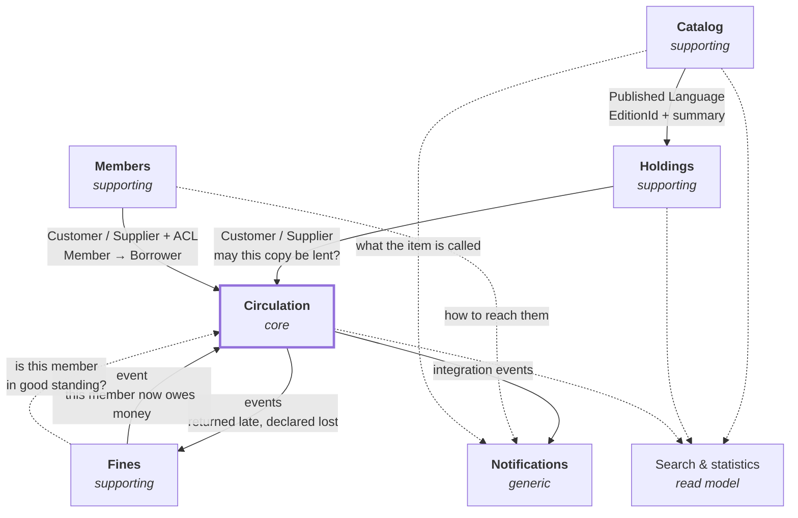

# Strategic design

The solution space of LibraryManagement: the language the domain is described in, how it divides
into subdomains, which bounded contexts implement them, and how those contexts relate.

This document decides boundaries. It does not decide aggregates, entities or value objects — that is
tactical design, and it is done inside one context at a time, after its boundary is settled.

## 1. Vision

A library's staff need to know what the library holds, who its members are, and where every item is
at any moment. The system serves the staff. Members do not use it: they are described by it, not
users of it.

Everything the system does exists to answer one of four questions.

* **What is this?** — the bibliographic description of a book, independent of any library.
* **What do we own, and where is it?** — this library's stock, its condition, its shelf.
* **Who has it, until when, and who is waiting?** — circulation.
* **Who owes us what?** — money.

The third question is the one a library is *for*. The first two exist to make it answerable, and the
fourth is a consequence of it.

## 2. The boundary test

One question decides most of this document, and it is worth stating before the answers it produced.

> **Can these two facts disagree for a few seconds without a librarian noticing something is wrong?**
>
> If **no**, they belong to the same context: the rule tying them is an invariant, and an invariant
> that spans two contexts is not enforced, only hoped for.
> If **yes**, they belong to different contexts: the rule tying them is a convergence, and
> convergence is what messages between contexts are for.

It is not a technical criterion dressed up. It asks whether a business rule is something the model
must hold true at every instant, or something the business is content to see settle.

Two applications, in opposite directions, are recorded below: holds belong with loans, fines do not.

## 3. Assumptions

These shape the model and were not settled when it was written. Each is reversible today at the cost
of one context's design; none is reversible cheaply once its module carries data.

| Assumption | Alternative that was open | Status |
|---|---|---|
| Three bibliographic levels: Work → Edition → Copy | Two levels (Edition → Copy), or full FRBR with Expression | assumed |
| A single library, one location | A network of branches, with transfers between them | assumed |
| Acquisitions and serials are out of scope | Either as a bounded context of its own | assumed |
| A hold is placed on an *edition* | On a work — any edition will do — or on a specific copy | **decided** |
| Overdue fines are charged, from the first cent | Fine-free, or a threshold below which nothing is blocked | **decided** |
| A flat cap of five items, all categories alike | A policy table indexed by member category | **decided** |

The fine-free alternative is not a simplification for its own sake: many public libraries have
abolished fines, having found they deter the poorest readers and cost more to collect than they
raise. The model charges them, but note that **a fine and a suspension are two different levers**,
and the second works without the first.

The loan rules themselves — cap, durations, reminder schedule, when an item is declared lost — are
set out in [tactical-design-circulation.md](tactical-design-circulation.md).

## 4. Ubiquitous language

The code is written in English by standing convention, and the domain is described in French. A
single language has to win, or every concept acquires two names and they drift. English wins, and
this glossary is the bridge to the domain experts rather than a translation exercise: the French
term is what a librarian actually says, and it is the authority when the two disagree.

### Catalog

| Code | Métier | Meaning |
|---|---|---|
| `Work` | Œuvre | An intellectual creation, independent of any printing. *Le Petit Prince* is one work. |
| `Edition` | Édition | One published form of a work, identified by an ISBN. Gallimard 2015 paperback. |
| `Author` | Auteur | A person or body responsible for a work. |
| `Publisher` | Éditeur | Note the false friend: `Editor` is *not* the French *éditeur*. |
| `Series` | Collection | A named publisher's series an edition belongs to. |
| `Subject` | Sujet | A subject heading assigned to a work. |
| `Shelfmark` | Cote | The classification code that decides where a copy stands. |

### Holdings

| Code | Métier | Meaning |
|---|---|---|
| `Copy` | Exemplaire | One physical object the library owns, of one edition. |
| `Barcode` | Code-barres | The label that identifies a copy at the desk. Unique in the library. |
| `Condition` | État | The physical state of a copy: good, worn, damaged. |
| `Withdrawn` | Désherbé | Removed from the collection **on purpose**. *Désherbage* is the librarian's word for weeding: routine work, not a loss. |
| `Lost` | Perdu | Unaccounted for. Distinct from withdrawn — nobody decided it. |
| `ReferenceOnly` | Exclu du prêt | Held, consultable on site, never lent. |
| `Stocktake` | Récolement | The physical check of the shelves against the records. Note this is what a librarian means by *inventaire*, which is why this context is not called Inventory. |

### Circulation

| Code | Métier | Meaning |
|---|---|---|
| `Loan` | Prêt | One copy, held by one borrower, until a date. |
| `Checkout` | Emprunt | The act of starting a loan. |
| `Return` | Retour | The act of ending one. |
| `Renewal` | Prolongation | Moving a due date forward without returning the copy. |
| `DueDate` | Date de retour | When the copy is expected back. |
| `Overdue` | En retard | Past the due date and not returned. |
| `Hold` | Réservation | A claim on the next available copy of an edition. |
| `HoldQueue` | File d'attente | The ordered claims on one edition. |
| `Trapped` | Mis de côté | A returned copy set aside for the first hold instead of being shelved. |
| `PickupDeadline` | Délai de retrait | How long a trapped copy waits before the claim lapses. |
| `Borrower` | Emprunteur | A member, seen as circulation sees them: an identity, a category, a current load, a standing. |
| `LoanPolicy` | Règles de prêt | How many, how long, how often — per member category and material type. |

### Members

| Code | Métier | Meaning |
|---|---|---|
| `Member` | Adhérent | A person entitled to borrow. Never an employee. |
| `Membership` | Abonnement | The period during which that entitlement holds. |
| `MemberCategory` | Catégorie | Adult, child, student. Decides what circulation allows, but is not itself a circulation concept. |
| `LibraryCard` | Carte | What the member presents at the desk. |

### Fines

| Code | Métier | Meaning |
|---|---|---|
| `OverdueFine` | Amende de retard | Charged for time. Small, frequent, often waived. |
| `ReplacementCharge` | Frais de remplacement | Charged for an item that will not come back. Large, rare, a different decision entirely. |
| `Waiver` | Remise gracieuse | A charge cancelled by a decision rather than by payment. |
| `Standing` | Situation | Whether a member owes enough to lose the right to borrow. |

## 5. Subdomains

Classification describes the *business*, not how interesting the code is. A subdomain is core when
the library would be worse at being a library without it, not when it is pleasant to model.

**Core — Circulation.** Every rule that makes a library more than a warehouse. How many items a
category of member may hold at once, for how long, how often a loan may be renewed, who is next in a
hold queue, what a returned copy does when someone is waiting for it. Stateful, temporal, and
specific to how this library chooses to operate. This is where modelling effort belongs.

**Supporting — Catalog.** Essential and mostly standardised. Bibliographic description follows rules
the profession settled long ago; a library does not become better by inventing its own. A record for
a given ISBN is the same everywhere, which is why records are imported rather than typed. Rich in
structure, thin in behaviour.

**Supporting — Holdings.** What *this* library owns. The counterpart of the catalog's universality: a
bibliographic record is shared with every library in the world, a copy with a barcode and a worn
spine is ours alone.

**Supporting — Members.** Who is entitled to borrow, and until when. The rules concern the
subscription — when it starts, when it lapses, what category it grants. Not what a category may do.

**Supporting — Fines.** Money owed to the library, and the decisions that create, cancel or settle
it.

**Generic — Staff access, Notifications.** Nothing about libraries. Authentication for employees,
sending an email when a hold becomes available.

## 6. Bounded contexts

Five business contexts. Each section says what the context owns and — as importantly — what it
refuses to own.

### Catalog

**Owns.** Work, Edition, Author, Publisher, Series, Subject, Shelfmark.

**Refuses.** How many copies exist, where they stand, whether one can be borrowed. A catalog is
meaningful for a library that owns nothing.

**Publishes.** An `EditionId` and a bibliographic summary — enough for another context to name an
edition without reproducing its description.

### Holdings

**Owns.** Copy, barcode, shelfmark placement, acquisition date, condition, and the copy's own
status: on the shelf, in repair, lost, withdrawn, reference-only.

**Refuses.** The bibliographic description — it holds an `EditionId` and nothing more. And who
currently has a copy: that is a circulation fact, not a property of the object.

**Depends on.** Catalog, for the identity of the edition a copy is a copy of.

Availability splits in two, and only half of it lives here. Holdings knows a copy is reference-only,
in repair, lost or withdrawn. It does not know it is out on loan. Availability is the conjunction of
the two and is computed by whoever asks, never stored twice.

### Circulation — core

**Owns.** Loan, renewal, return, hold, hold queue, trapping, pickup deadline, and the loan policy.

**Refuses.** The copy's physical description and the member's address. It needs neither.

**Depends on.** Holdings, to know a copy exists and may be lent. Members, to know a person is
entitled to borrow and in which category. Fines, for one question only: is this member in good
standing?

**Holds live here, not in a context of their own.** When a copy comes back, one decision has to be
made in one breath: the loan closes, and the copy is either shelved or trapped for the first hold,
which then starts its pickup countdown. Split that across two contexts and you get, between the two
transactions, either a copy on the shelf that someone was promised or a hold announced ready for a
copy nobody set aside. Both are visible at the desk, to the member. It is the most frequent
operation of the day.

The language says the same thing: the profession has one word — *la circulation* — for loans,
returns, renewals and holds together. And the limit on how much a member may have going at once
usually counts loans and holds as one number, which a boundary between them would make
unenforceable.

**The loan policy lives here, not in Members.** Members owns what category a member is; Circulation
owns what that category may do. "An adult may hold ten items for twenty-one days" is a circulation
rule that happens to be indexed by a membership concept. Putting it in Members would make the loan
rules change every time the subscription rules did.

**The policy is data, not code.** Durations and quotas per member category and material type change
by a decision of the library, not of the developers. Written into the aggregates, every such decision
becomes a deployment.

**`Borrower` is not `Member`.** Circulation keeps its own model of the person: an identity, a
category, a current load, a standing. Not their address, not their phone number, not when they
joined. The translation is an anticorruption layer and it stays thin on purpose — the moment it
starts copying fields, the boundary has failed.

### Members

**Owns.** Member, membership period, member category, library card, contact details.

**Refuses.** Loans, and the borrowing limits attached to a category.

**Never an employee.** A member is a *domain* concept: a subscription, a category, an entitlement. An
employee is an *access* concept: they authenticate and act. Conflating them is a common mistake, and
it is the employee — not the member — that `IAuditable.CreatedBy` must name.

### Fines

**Owns.** Overdue fines, replacement charges, waivers, payments, and a member's standing.

**Refuses.** Deciding whether a return was late — that is a circulation fact. And deciding what a
debt forbids: "a member owing more than ten euros may not borrow" is a circulation rule that consults
a fines fact, exactly as the category rule consults a members fact.

**Depends on.** Circulation, for the events that create a charge.

This is the boundary test applied in the other direction. A fine created two hundred milliseconds
after a late return is invisible to everyone; a fine that failed to be created is reconciled, not
noticed at the desk. Everything else about it differs too: the vocabulary is money, not lending; the
lifetime outlives the loan — one can owe for a book returned three years ago; the actors differ,
a desk librarian handling documents against a till handling cash; and the tariff changes on its own
schedule, by amnesty or exemption, without the loan rules moving.

**Who decides the amount matters.** Circulation publishes `LoanReturnedLate(loanId, memberId,
daysLate)` and Fines decides what it costs. If Circulation computed the amount, the tariff would have
moved into lending.

**`OverdueFine` and `ReplacementCharge` are not the same type.** One is charged for time and is small,
frequent and often waived. The other is charged for an item that will not come back, and is a
different decision at a different order of magnitude. A single `Fine` with an enum would merge two
policies that have nothing in common.

### Staff access, Notifications — generic

Out of the domain. Notifications reacts to integration events published by Circulation — a hold
became available, an item is overdue — and knows nothing about libraries beyond the text of the
message.

## 7. Search is not a bounded context

A librarian searching wants one list holding the title and author (**Catalog**), how many copies
exist and where they are (**Holdings**), which is free and when the next is due back
(**Circulation**). Three contexts.

Made a context, it would own nothing and duplicate everything. Put in Catalog, it would force Catalog
to know about availability, and the cleanest boundary in the model would fall.

**Search is a read model.** A projection fed by events from the three, and on one database it can be
a view. Loan statistics — on which a library's budget depends — are the same case.

This is where strict command-query separation stops being a matter of style and becomes structural:
**the read side may cross boundaries precisely because it changes nothing and can therefore break no
invariant.** Only the write side owes them anything.

## 8. Context map



Solid arrows point downstream — at the context that must adapt when the other changes. Dashed arrows
are queries and projections: they carry no authority and change nothing.

| Upstream | Downstream | Pattern | Why |
|---|---|---|---|
| Catalog | Holdings | Published Language | Holdings needs to name an edition, not describe it. Identifier plus summary is all that crosses. |
| Holdings | Circulation | Customer / Supplier | A loan cannot start on a copy that does not exist or may not be lent. |
| Members | Circulation | Customer / Supplier + ACL | Same, plus a translation: `Member` becomes `Borrower`, and most of the member is dropped on the way. |
| Circulation | Fines | Published Language, via events | Circulation announces facts. Fines prices them. |
| Fines | Circulation | Published Language, via events | A new debt cancels the borrower's holds. |
| Fines | Circulation | Open Host Service | One question, one answer: may this member borrow? |
| Circulation | Notifications | Published Language, via events | Circulation does not know anyone is listening. |
| Members, Catalog | Notifications | Open Host Service | A message needs an address and a title. Circulation supplies neither, and must not learn either. |

Everything is Customer/Supplier rather than Conformist because one team owns all of it: a downstream
context that finds a contract awkward can have it changed, and should say so rather than work around
it.

**The Circulation ↔ Fines pair is the one cycle in the map, and it is deliberate.** Circulation is
upstream for the facts — returned late, declared lost — and downstream for what those facts cost it.
Two flows run the other way, and the boundary test separates them:

* **A new debt cancels the borrower's holds.** Can "this member owes money" and "their holds are
  gone" disagree for a few seconds unnoticed? Yes — nobody is at the desk when a fine is assessed.
  An event, asynchronous.
* **May this member borrow?** Asked at the counter, with the member standing there having possibly
  just paid. A projection lag would be visible. A query, synchronous.

The cycle stays out of the assembly graph by inversion: **Circulation declares the port, Fines
implements it.** The anticorruption layer belongs to the downstream context, which for that one
question is Circulation.

**Notifications is downstream of three contexts and authoritative over none.** A message needs a
circulation fact, a way to reach the member, and the title of the item — which come from Circulation,
Members and Catalog respectively. That composition is exactly why Circulation never learns an email
address: it publishes what happened, and something else decides who hears about it and how.

**There is no shared kernel in the DDD sense.** `LibraryManagement.Shared.Domain` and `.Application`
hold `Entity`, `ValueObject`, `Result` and the CQS abstractions — building blocks, not business
concepts. No context shares a domain model with another, and none should: a shared `Book` between
Catalog and Circulation would be the first step back to a single model with five namespaces.

**Nothing is built on top of Circulation.** The core is downstream of almost everything and upstream
of nothing that matters. That is the shape to preserve: the rules most likely to change are the ones
nothing else depends on.

## 9. The model under stress

A boundary is only worth what it withstands. The hardest ordinary event in a library is a borrowed
copy declared lost — it touches four contexts at once.

| Context | What happens |
|---|---|
| **Circulation** | The loan ends, but not by a return. A terminal state of its own, or the loan statistics start lying. |
| **Holdings** | The copy becomes `Lost`. It leaves the lendable stock, but it is **not withdrawn**: nobody decided to part with it. |
| **Fines** | A `ReplacementCharge`, not an `OverdueFine`. Different amount, different reason, different waiver rules. |
| **Circulation** | Holds queuing on that edition must be reassigned or told. |
| **Catalog** | **Nothing.** The work still exists, and so does the edition. |

The last line is the proof that the Catalog / Holdings boundary is right: the most destructive
ordinary event in the system does not touch it.

## 10. Consequences for the codebase

Five business modules, plus generic ones as they appear:

```
src/
  Shared/        Domain, Application, Infrastructure   (already built)
  Catalog/
  Holdings/
  Circulation/
  Members/
  Fines/
```

One database, one schema per module. **No foreign key crosses a schema.** A module referencing
another's row holds its identifier and nothing else — the database will not enforce that reference,
and that is the point: an integrity constraint across modules is a coupling the compiler cannot see.

**One `DbContext` per module** follows from wanting the modules genuinely separate. A single context
with five schemas would compile, and one `DbSet<Copy>` referenced from a Circulation handler would
end the separation without anything failing.

That settles the question left open when the shared infrastructure was written:
**`ITransactionManager` cannot be resolved by type alone**, because five modules will register five
implementations and the last one wins. A command belongs to exactly one module — the rule that a
command never dispatches another command guarantees it — so the dispatcher must resolve the
transaction manager of *that* module. It is a design task for the first module, not for the kernel.

## 11. Open questions

* Whether `Work` is an aggregate root holding its editions, or `Edition` is a root of its own.
  Depends on whether an edition can be catalogued before its work is known, and on whether the
  library ever needs "all editions of this work" transactionally. Tactical design, Catalog.
* Whether a hold may be placed on a *work* — any edition will do — as well as on an edition. Members
  ask for both, and the queue rules differ.
* Whether a copy's loan history stays in Circulation forever or is archived. It is the only thing in
  the system that grows without bound.
* Whether a member may be blocked by something other than money — too many overdues, a lost card.
  If so, `Standing` is a circulation concept that consults fines, not a fines concept.
