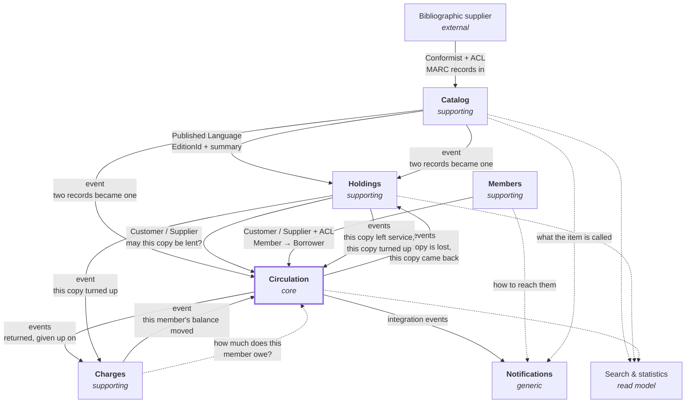

# Strategic design

The solution space of LibraryManagement: the language the domain is described in, how it divides
into subdomains, which bounded contexts implement them, and how those contexts relate.

This document decides boundaries. It does not decide aggregates, entities or value objects — that is
tactical design, and it is done inside one context at a time, after its boundary is settled.

## 1. Vision

A library's staff need to know what the library holds, who its members are, and where every item is
at any moment. The system serves the staff. Members do not use it: they are described by it, not
users of it.

Everything the system does exists to answer one of four questions.

* **What is this?** — the bibliographic description of a book, independent of any library.
* **What do we own, and where is it?** — this library's stock, its condition, its shelf.
* **Who has it, until when, and who is waiting?** — circulation.
* **Who owes us what?** — money.

The third question is the one a library is *for*. The first two exist to make it answerable, and the
fourth is a consequence of it.

## 2. The boundary test

One question decides most of this document, and it is worth stating before the answers it produced.

> **Can these two facts disagree for a few seconds without a librarian noticing something is wrong?**
>
> If **no**, they belong to the same context: the rule tying them is an invariant, and an invariant
> that spans two contexts is not enforced, only hoped for.
> If **yes**, they belong to different contexts: the rule tying them is a convergence, and
> convergence is what messages between contexts are for.

It is not a technical criterion dressed up. It asks whether a business rule is something the model
must hold true at every instant, or something the business is content to see settle.

Two applications, in opposite directions, are recorded below: holds belong with loans, fines do not.

## 3. Assumptions

These shape the model and were not settled when it was written. Each is reversible today at the cost
of one context's design; none is reversible cheaply once its module carries data.

| Assumption | Alternative that was open | Status |
|---|---|---|
| Three bibliographic levels: Work → Edition → Copy | Two levels (Edition → Copy), or full FRBR with Expression | assumed |
| A single library, one location | A network of branches, with transfers between them | assumed |
| Acquisitions and serials are out of scope | Either as a bounded context of its own | assumed |
| A hold is placed on an *edition* | On a work — any edition will do — or on a specific copy | **decided** |
| Overdue fines are charged, from the first cent | Fine-free, or a threshold below which nothing is blocked | **decided** |
| A flat cap of five items, all categories alike | A policy table indexed by member category | **decided** |
| A due date never falls on a closed day, and a closed day is never billed | Calendar days throughout, closures ignored | **decided** |

The fine-free alternative is not a simplification for its own sake: many public libraries have
abolished fines, having found they deter the poorest readers and cost more to collect than they
raise. The model charges them, but note that **a fine and a suspension are two different levers**,
and the second works without the first.

The loan rules themselves — cap, durations, reminder schedule, when an item is declared lost, and
the opening calendar the durations are counted across — are set out in
[tactical-design-circulation.md](tactical-design-circulation.md).

## 4. Ubiquitous language

The code is written in English by standing convention, and the domain is described in French. A
single language has to win, or every concept acquires two names and they drift. English wins, and
this glossary is the bridge to the domain experts rather than a translation exercise: the French
term is what a librarian actually says, and it is the authority when the two disagree.

**Which English, in full.** American spelling, and `Catalog` never `Catalogue` — including in
prose, comments and document titles. Naming a language without naming its variety leaves the
question open at every file, and it was answered twice: the schema, the error codes and the
assemblies were spelled one way and the queries and the prose the other. The immovable half won,
because a schema name and an error code are contracts and a document is not.

### Catalog

| Code | Métier | Meaning |
|---|---|---|
| `Work` | Œuvre | An intellectual creation, independent of any printing. *Le Petit Prince* is one work. |
| `PreferredTitle` | Titre privilégié | The title a work is filed under. It is a cataloger's decision, not a description: *Le Petit Prince*, *The Little Prince* and *Der kleine Prinz* are one work whose preferred title is one of the three. Plain `Title` is refused — an edition will one day carry the title on its own title page, and the word would then mean two things in one context. |
| `Edition` | Édition | One published form of a work, identified by an ISBN when it bears one. Gallimard 2015 paperback. Equivalent to the **Manifestation** of the IFLA LRM; the day Expression is modeled, this type already stands in its place. |
| `EditionStatement` | Mention d'édition | The statement printed on the book — *2ᵉ édition revue et corrigée*, ISBD area 2. It is a fact **carried by** an `Edition` and **is not** one. The row exists because the profession says *édition* for both, and the model may only say it for one. |
| `Author` | Auteur | A person or body responsible for a work. The type is an authority record, and the name is a role: the day a second role is modeled — translator, illustrator — `Author` becomes an `Agent` of the LRM with an `AgentKind`, `Work.AuthorIds` becomes a set of `Contribution { AgentId, Role }`, and `LifeYears` becomes `ExistenceDates`. Named here so the rename is a decision rather than a discovery. |
| `PreferredName` | Vedette | The name form a person or body is filed under. The profession's prose says *heading* and RDA says *preferred name*; they are one concept, and this row is what keeps the synonym from becoming two — so the code says `PreferredName`, once, and never `Heading` or `AuthorizedName`. |
| `VariantName` | Forme rejetée | Another form the same person or body is known by, which leads back to the record. Pairs with `PreferredName`: *preferred* and *variant* is the one figure of speech this context uses, for names as for titles. |
| `NameForm` | Forme du nom | A name in filing order — family name first, as in `"Saint-Exupéry, Antoine de"`. Not `PersonName`: the same type carries corporate bodies, sovereigns and mononyms, none of which is a person's name in the ordinary sense. |
| `Publisher` | Éditeur | Note the false friend: `Editor` is *not* the French *éditeur*. |
| `Series` | Collection | A named publisher's series an edition belongs to. |
| `Subject` | Sujet | A subject heading assigned to a work. |
| `ClassificationScheme` | Plan de classement | The scheme the class number is drawn from — Dewey, UDC, a local scheme. A library may run two. |
| `ClassNumber` | Indice | The class number itself, derived from subject analysis. Bibliographic: the same for every library using the scheme. Only the pair `(scheme, number)` identifies it. What it feeds — the shelfmark on each copy — is a Holdings fact. |
| `MaterialType` | Type de document | Book, DVD, periodical. A bibliographic fact, owned here: it describes what the thing *is*, and Circulation merely indexes its rules by it — the same division that puts `MemberCategory` in Members and the borrowing limits in Circulation. |

### Holdings

| Code | Métier | Meaning |
|---|---|---|
| `Copy` | Exemplaire | One physical object the library owns, of one edition. This context's word for it, and the only one its code uses: *item* is refused here, because the cap in §2 of the tactical design counted loans and holds under that name and neither of them is one. Ordinary English elsewhere in this document — *an item that will not come back* — is prose and not a concept. |
| `Barcode` | Code-barres | The label that identifies a copy at the desk. Unique in the library. |
| `Shelfmark` | Cote | The term for the call number that decides where *this copy* stands — `Shelfmark` in code and in prose, *call number* never. Per copy, not per edition: one copy of a title may live in the children's section and another in the reserve. Built from the class number Catalog assigns, owned here. |
| `Condition` | État | The physical state of a copy: good, worn, damaged. |
| `AcquisitionDate` | Date d'acquisition | When the library took the copy into its collection. Not the edition's publication date, which is bibliographic and belongs to Catalog. |
| `Stocktake` | Récolement | The physical check of the shelves against the records. Note this is what a librarian means by *inventaire*, which is why this context is not called Inventory. |

**The status of a copy — the whole set, stated once.** It is written here and nowhere else; §6 and
the tactical design point at this row rather than re-enumerating it, because an enumeration written
three times is an enumeration that has not been decided.

| Code | Métier | Meaning |
|---|---|---|
| `InService` | En service | Nothing about this copy prevents it from being lent, as far as Holdings can tell. Not `OnShelf`: a copy borrowed last Tuesday is not on a shelf, and this context has no way to know that it isn't — a value naming a physical location would be false for a large share of the stock at any moment, and silently so. Whether it is out on loan is a Circulation fact — see §6. |
| `InRepair` | En réparation | Temporarily out of the lendable stock, and expected back in it. |
| `ReferenceOnly` | Exclu du prêt | Held, consultable on site, never lent. |
| `Withdrawn` | Désherbé | Removed from the collection **on purpose**. *Désherbage* is the librarian's word for weeding: routine work, not a loss. |
| `Lost` | Perdu | Unaccounted for. Distinct from withdrawn — nobody decided it. Distinct too from a loan's `DeclaredLost`, which *is* a decision: see the Circulation glossary. |

### Circulation

| Code | Métier | Meaning |
|---|---|---|
| `Loan` | Prêt | One copy, held by one borrower, until a date. |
| `Checkout` | Emprunt | The act of starting a loan. |
| `Return` | Retour | The act of ending one. |
| `Renewal` | Prolongation | Moving a due date forward without returning the copy. |
| `DueDate` | Date de retour | When the copy is expected back. Never a day the library is closed: a deadline a member must meet falls on a day they can meet it. |
| `Overdue` | En retard | Past the due date and not returned. |
| `Hold` | Réservation | A claim on the next available copy of an edition. |
| `HoldQueue` | File d'attente | The ordered claims on one edition. |
| `Trapped` | Mis de côté | A returned copy set aside for the first hold instead of being shelved. |
| `PickupDeadline` | Délai de retrait | How long a trapped copy waits before the claim lapses. |
| `DeclaredLost` | Déclaré perdu | The terminal state of a loan that ended by a decision rather than by a return. The participle is the point: Holdings' `Lost` is something nobody decided, this is something someone did. |
| `Borrower` | Emprunteur | A member, seen as circulation sees them: an identity, a category, a current load, a standing. `BorrowerId` and `MemberId` carry the **same** value — it is the model that the anticorruption layer translates, never the identity. Nobody should go looking for a correspondence table. |
| `CirculationPolicy` | Règles de circulation | How many, how long, how often — and what a debt forbids. It governs holds and pickup deadlines as much as loans, which is why it is not called a loan policy. |
| `OpeningCalendar` | Calendrier d'ouverture | The days the library is open: the policy's record of weekly closed days and dated closures — public holidays entered as dates, never computed. Owned here because what a closed day *does* is a circulation rule: a due date slides off it, and it is never billed. |
| `Debt` | Dette | A balance the borrower has not settled, **seen from here**. Charges says `Balance` and never `Debt`; Circulation says `Debt` and never `Balance`. One amount, two words, because each context names what it does with it: Charges records it, Circulation is what it forbids. |
| `Standing` | Situation | Whether what a borrower owes forbids borrowing, renewing or placing a hold. Judged **here**, from the balance Charges exposes: Charges states an amount and never the consequence. |

### Members

| Code | Métier | Meaning |
|---|---|---|
| `Member` | Adhérent | A person entitled to borrow. Never an employee. |
| `Membership` | Abonnement | The period during which that entitlement holds. |
| `MemberCategory` | Catégorie | Adult, child, student. Decides what circulation allows, but is not itself a circulation concept. |
| `LibraryCard` | Carte | What the member presents at the desk. |
| `Guardian` | Représentant légal | Who a minor is reached through. A member has an identity, and separately a way of being reached that may belong to somebody else — which is why this is a Members concept and not a Notifications one. Wider than *parent* on purpose: a protected adult under *tutelle* has one too. |
| `Enrollment` | Inscription | The act of becoming a member: identity recorded, category decided, card issued, the first membership period started. A returning member **renews**, never re-enrolls — the identity persists, and the loan history with it. |
| `Entitlement` | Droit d'emprunter | Whether a membership currently holds, computed against the clock and never stored. What Members answers when Circulation asks — never `Standing`, which is the judgement Circulation forms from money. |

### Charges

| Code | Métier | Meaning |
|---|---|---|
| `OverdueFine` | Amende de retard | Charged for time. Small, frequent, often waived. |
| `ReplacementCharge` | Frais de remplacement | Charged for an item that will not come back. Large, rare, a different decision entirely. |
| `DamageCharge` | Frais de dégradation | Charged for an item returned spoiled. The observation is Circulation's, made at the return with the borrower identified; the price is Charges'. A third kind beside the fine and the replacement, because an object spoiled is neither time passing nor an object gone. |
| `Waiver` | Remise gracieuse | A charge cancelled by a decision rather than by payment. |
| `Payment` | Règlement | Money received against what a member owes. Distinct from a `Waiver`: one settles the charge, the other cancels it, and a library counts the two separately. |
| `Balance` | Solde | What a member currently owes, every charge and payment netted. A statement of money, never of rights: what a balance forbids is Circulation's judgement, recorded there as `Standing`. This context's only word for the amount — it never says `Debt`, which is the Circulation word for the same figure seen as a consequence. |

## 5. Subdomains

Classification describes the *business*, not how interesting the code is. A subdomain is core when
the library would be worse at being a library without it, not when it is pleasant to model.

**Core — Circulation.** Every rule that makes a library more than a warehouse. How many items a
category of member may hold at once, for how long, how often a loan may be renewed, who is next in a
hold queue, what a returned copy does when someone is waiting for it. Stateful, temporal, and
specific to how this library chooses to operate. This is where modeling effort belongs.

**Supporting — Catalog.** Essential and mostly standardized. Bibliographic description follows rules
the profession settled long ago; a library does not become better by inventing its own. A record for
a given ISBN is the same everywhere, which is why records are imported rather than typed. Rich in
structure, thin in behavior.

**Supporting — Holdings.** What *this* library owns. The counterpart of the catalog's universality: a
bibliographic record is shared with every library in the world, a copy with a barcode and a worn
spine is ours alone.

**Supporting — Members.** Who is entitled to borrow, and until when. The rules concern the
subscription — when it starts, when it lapses, what category it grants. Not what a category may do.

**Supporting — Charges.** Money owed to the library, and the decisions that create, cancel or settle
it.

**Generic — Staff access, Notifications.** Nothing about libraries. Authentication for employees,
sending an email when a hold becomes available.

## 6. Bounded contexts

Five business contexts. Each section says what the context owns and — as importantly — what it
refuses to own.

### Catalog

**Owns.** Work, Edition, Author, Publisher, Series, Subject, class number and classification scheme,
material type.

**Refuses.** How many copies exist, where they stand, whether one can be borrowed. A catalog is
meaningful for a library that owns nothing. The shelfmark went with the copies: the *class number*
of a work is bibliographic, the *shelfmark* built from it belongs to each copy, and two copies of
one edition may stand in two sections.

**Publishes.** An `EditionId` and a bibliographic summary — enough for another context to name an
edition without reproducing its description.

**Fed by import, not by typing.** This is the reason the subdomain is supporting: a record for a
given ISBN is the same everywhere, so records come from an upstream bibliographic supplier — a
national library, a union catalog — in a MARC-family format. That upstream is external and does
not negotiate, so the relationship is Conformist and the translation is an anticorruption layer at
the border: nothing shaped like MARC crosses into the model. The manual commands remain as the
fallback for what no supplier describes — local grey literature, self-published works — not as the
main flow. The import pipeline is future work; it is named here so nobody mistakes the fallback for
the design.

### Holdings

**Owns.** Copy, barcode, shelfmark, acquisition date, condition, and the copy's own status — whose
values are enumerated once, in the Holdings glossary of §4, and nowhere else.

**Refuses.** The bibliographic description — it holds an `EditionId` and nothing more. And who
currently has a copy: that is a circulation fact, not a property of the object.

**Depends on.** Catalog, for the identity of the edition a copy is a copy of.

Availability splits in two, and only half of it lives here. Holdings knows a copy is reference-only,
in repair, lost or withdrawn. It does not know it is out on loan. Availability is the conjunction of
the two and is computed by whoever asks, never stored twice.

The aggregate, its invariants and the moments that change it are set out in
[tactical-design-holdings.md](tactical-design-holdings.md).

### Circulation — core

**Owns.** Loan, renewal, return, hold, hold queue, trapping, pickup deadline, and the circulation
policy.

**Refuses.** The copy's physical description and the member's address. It needs neither.

**Depends on.** Holdings, to know a copy exists and may be lent. Members, to know a person is
entitled to borrow and in which category. Charges, for one question only: how much does this member
owe? What that amount forbids — the borrower's *standing* — is judged here, by the circulation
policy, never by the context that states the amount.

**Holds live here, not in a context of their own.** When a copy comes back, one decision has to be
made in one breath: the loan closes, and the copy is either shelved or trapped for the first hold,
which then starts its pickup countdown. Split that across two contexts and you get, between the two
transactions, either a copy on the shelf that someone was promised or a hold announced ready for a
copy nobody set aside. Both are visible at the desk, to the member. It is the most frequent
operation of the day.

The language says the same thing: the profession has one word — *la circulation* — for loans,
returns, renewals and holds together. And the limit on how much a member may have going at once
usually counts loans and holds as one number, which a boundary between them would make
unenforceable.

**The circulation policy lives here, not in Members.** Members owns what category a member is;
Circulation owns what that category may do. "An adult may hold ten items for twenty-one days" is a
circulation rule that happens to be indexed by a membership concept. Putting it in Members would make
the lending rules change every time the subscription rules did.

**The policy is data, not code.** Durations, quotas and the opening calendar change by a decision
of the library, not of the developers. Written into the aggregates, every such decision becomes a
deployment.

**`Borrower` is not `Member`.** Circulation keeps its own model of the person: an identity, a
category, a current load, a standing. Not their address, not their phone number, not when they
joined. The translation is an anticorruption layer and it stays thin on purpose — the moment it
starts copying fields, the boundary has failed.

### Members

**Owns.** Member, membership period, member category, library card, contact details.

**Refuses.** Loans, and the borrowing limits attached to a category.

**Never an employee.** A member is a *domain* concept: a subscription, a category, an entitlement. An
employee is an *access* concept: they authenticate and act. Conflating them is a common mistake, and
it is the employee — not the member — that `IAuditable.CreatedBy` must name.

The aggregate, its invariants and the moments that change it are set out in
[tactical-design-members.md](tactical-design-members.md).

### Charges

**Owns.** Overdue fines, replacement charges, damage charges, waivers, payments, and a member's
balance.

**Refuses.** Deciding whether a return was late — that is a circulation fact. And deciding what a
debt forbids: "a member owing more than ten euros may not borrow" is a circulation rule that consults
a charges fact, exactly as the category rule consults a members fact. The vocabulary follows: this
context knows a `Balance`, and `Standing` — the judgement — is a Circulation word.

**Depends on.** Circulation, for the events that create a charge.

This is the boundary test applied in the other direction. A fine created two hundred milliseconds
after a late return is invisible to everyone; a fine that failed to be created is reconciled, not
noticed at the desk. Everything else about it differs too: the vocabulary is money, not lending; the
lifetime outlives the loan — one can owe for a book returned three years ago; the actors differ,
a desk librarian handling documents against a till handling cash; and the tariff changes on its own
schedule, by amnesty or exemption, without the loan rules moving.

**Who decides the amount matters.** Circulation publishes `LoanReturned(loanId, memberId,
daysLate)` — punctual returns included — and Charges decides what it costs, when anything does. If Circulation computed the amount, the tariff would
have moved into lending.

**`OverdueFine` and `ReplacementCharge` are not the same type.** One is charged for time and is small,
frequent and often waived. The other is charged for an item that will not come back, and is a
different decision at a different order of magnitude. A single `Fine` with an enum would merge two
policies that have nothing in common — and it is why the context is called Charges rather than Fines:
a context named after one of its two concepts bends every later one toward it, and a replacement
charge is not a fine, as this paragraph exists to insist. The librarian's own umbrella word is
*frais*, and Charges is its English. The name proved its worth when the third kind arrived: a
`DamageCharge` — an item returned spoiled — is not a fine either, and the context that could
receive it without bending is the one that was not named after fines.

The aggregate, its invariants and the moments that change it are set out in
[tactical-design-charges.md](tactical-design-charges.md).

### Staff access, Notifications — generic

Out of the domain. Notifications reacts to integration events published by Circulation — a hold
became available, an item is overdue — and knows nothing about libraries beyond the text of the
message.

## 7. Search is not a bounded context

A librarian searching wants one list holding the title and author (**Catalog**), how many copies
exist and where they are (**Holdings**), which is free and when the next is due back
(**Circulation**). Three contexts.

Made a context, it would own nothing and duplicate everything. Put in Catalog, it would force Catalog
to know about availability, and the cleanest boundary in the model would fall.

**Search is a read model.** A projection fed by events from the three, and on one database it can be
a view. Loan statistics — on which a library's budget depends — are the same case. A page of
*detail* is not: one member's file starts from an identifier already in hand and composes each
module's published query at the edge, never needing the SQL below — §10 records the rules.

This is where strict command-query separation stops being a matter of style and becomes structural:
**the read side may cross boundaries precisely because it changes nothing and can therefore break no
invariant.** Only the write side owes them anything.

**Two things will be called search, so they get two names now.** `AccessPoint` is the catalog's
own index, local to Catalog and fed by Catalog's events: every heading, variant form and title is an
access point, and it answers *which records answer to this form?* — the profession's word, kept.
`Discovery` is the name reserved for the cross-module projection described above, the one that adds
copies and availability. Naming the second only when it is built would mean naming it *search*,
which the first already answers to.

## 8. Context map



Solid arrows point downstream — at the context that must adapt when the other changes. Dashed arrows
are queries and projections: they carry no authority and change nothing.

| Upstream | Downstream | Pattern | Why |
|---|---|---|---|
| Bibliographic supplier | Catalog | Conformist + ACL | The format is theirs — MARC does not negotiate. The ACL keeps its shape at the border, and the manual commands stay as the fallback for what no supplier describes. |
| Catalog | Holdings | Published Language | Holdings needs to name an edition, not describe it. Identifier plus summary is all that crosses. |
| Holdings | Circulation | Customer / Supplier | A loan cannot start on a copy that does not exist or may not be lent. |
| Members | Circulation | Customer / Supplier + ACL | Same, plus a translation: `Member` becomes `Borrower`, and most of the member is dropped on the way. |
| Circulation | Charges | Published Language, via events | Circulation announces facts. Charges prices them. |
| Circulation | Holdings | Published Language, via events | A loan nobody returns ends as a copy nobody has; a copy over the desk cannot be unaccounted for. Circulation announces both; Holdings decides what its own status becomes. |
| Holdings | Circulation | Published Language, via events | A copy that leaves service takes any promise it carried with it, and a copy that turns up settles what its written-off loan was worth. Holdings announces; Circulation decides what its claims and loans do. |
| Holdings | Charges | Published Language, via events | A copy that turns up cancels the replacement still owed for it. |
| Charges | Circulation | Published Language, via events | A new debt cancels the borrower's holds. |
| Charges | Circulation | Customer / Supplier + ACL, dependency-inverted | One question, one answer: how much does this member owe? The threshold that turns the amount into a refusal stays in Circulation. Not an Open Host Service, though it looks like one: an OHS is a protocol published *by the upstream* for an open set of consumers, and here the downstream declares the port for its own single use — see the inversion described below. |
| Circulation | Notifications | Published Language, via events | Circulation does not know anyone is listening. |
| Members, Catalog | Notifications | Open Host Service | A message needs an address and a title. Circulation supplies neither, and must not learn either. |

Everything is Customer/Supplier rather than Conformist because one team owns all of it: a downstream
context that finds a contract awkward can have it changed, and should say so rather than work around
it.

**Two pairs in the map are cycles, and both are deliberate.** Circulation is upstream for the facts
it observes and downstream for what those facts mean elsewhere — and in each pair the two directions
are different questions, asked at different moments, which is what keeps the cycle from being a
tangle.

**Circulation ↔ Holdings** is the plainer of the two. Holdings answers *may this copy be lent?* at
the desk, synchronously, because a checkout waits on it. Circulation announces *this copy is lost*
afterwards, asynchronously, because nobody is standing there when a thirty-day-old loan is given up
on — and Holdings decides for itself what that means for the copy's status, which is why the arrow
carries a fact and not an instruction. The same fact reaches Holdings from a stocktake that failed
to find the copy, and neither route is privileged. The cycle turns the other way on the same terms:
Holdings announces that a copy left service or turned up, and Circulation decides alone what that
does to the promise on its hold shelf or to the loan it once gave up on — facts crossing in both
directions, instructions in neither.

**Circulation ↔ Charges** is the one that needed the inversion. Circulation is upstream for the facts
— returned late, declared lost — and downstream for what those facts cost it. Two flows run the
other way, and the boundary test separates them:

* **A new debt cancels the borrower's holds.** Can "this member owes money" and "their holds are
  gone" disagree for a few seconds unnoticed? Yes — nobody is at the desk when a fine is assessed.
  An event, asynchronous.
* **How much does this member owe?** Asked at the counter, with the member standing there having
  possibly just paid. A projection lag would be visible. A query, synchronous — and it answers with
  an amount, never with a verdict: the judgement of what the amount forbids stays on the asking side.

The cycle stays out of the assembly graph by inversion: **Circulation declares the port, Charges
implements it.** The anticorruption layer belongs to the downstream context, which for that one
question is Circulation.

These synchronous desk-time queries — the balance from Charges, the lendability of a copy from
Holdings — are also an architectural fact worth recording: they sit on the most frequent write path
of the system, and they are in-process calls only because this is a monolith. Extracting Circulation
into a service would put network hops inside every checkout. The concentration of synchronous edges
on the core's write path is a documented reason the deployment stays monolithic.

**Notifications is downstream of three contexts and authoritative over none.** A message needs a
circulation fact, a way to reach the member, and the title of the item — which come from Circulation,
Members and Catalog respectively. That composition is exactly why Circulation never learns an email
address: it publishes what happened, and something else decides who hears about it and how.

**There is no shared kernel in the DDD sense.** `LibraryManagement.Shared.Domain` and `.Application`
hold `Entity`, `ValueObject`, `Result` and the CQS abstractions — building blocks, not business
concepts. No context shares a domain model with another, and none should: a shared `Book` between
Catalog and Circulation would be the first step back to a single model with five namespaces.

**Nothing is built on top of Circulation's rules.** The core is downstream of almost everything, and
what runs the other way carries facts rather than authority: Charges, Holdings and Notifications
learn that something happened and each decides alone what it means for its own model. No context
depends on *how Circulation decides* — the cap, the standing, the pickup period, the escalation —
and that is the shape to preserve, because those are the rules most likely to change. An arrow out
of the core is safe exactly as long as it announces and never instructs.

## 9. The model under stress

A boundary is only worth what it withstands. The hardest ordinary event in a library is a borrowed
copy declared lost — it touches four contexts at once.

| Context | What happens |
|---|---|
| **Circulation** | The loan ends, but not by a return. A terminal state of its own, or the loan statistics start lying. |
| **Holdings** | The copy becomes `Lost`. It leaves the lendable stock, but it is **not withdrawn**: nobody decided to part with it. |
| **Charges** | A `ReplacementCharge`, not an `OverdueFine`. Different amount, different reason, different waiver rules. |
| **Circulation** | Holds queuing on that edition must be reassigned or told. |
| **Catalog** | **Nothing.** The work still exists, and so does the edition. |

The last line is the proof that the Catalog / Holdings boundary is right: the most destructive
ordinary event in the system does not touch it.

## 10. Consequences for the codebase

Five business modules, plus generic ones as they appear:

```
src/
  Shared/        Domain, Application, Infrastructure   (already built)
  Catalog/
  Holdings/
  Circulation/
  Members/
  Charges/
```

One database, one schema per module. **No foreign key crosses a schema.** A module referencing
another's row holds its identifier and nothing else — the database will not enforce that reference,
and that is the point: an integrity constraint across modules is a coupling the compiler cannot see.

**One `DbContext` per module** follows from wanting the modules genuinely separate. A single context
with five schemas would compile, and one `DbSet<Copy>` referenced from a Circulation handler would
end the separation without anything failing.

**Creating that schema is the host's decision, exactly as the provider is.** A module describes
tables and indexes and creates none, and a migration names an engine, which a module may not — so
each module's migrations live in a project of their own beside the host, never inside the module.
[migrations.md](migrations.md) records the arrangement, and the history table per schema that lets
five contexts share one database.

That settled the question left open when the shared infrastructure was written: **a unit of work
cannot be resolved by type alone**, because five modules register five implementations of one
interface and the last one answers for all of them. A command belongs to exactly one module — the
rule that a command never dispatches another command guarantees it — so the pipeline resolves the
unit of work of *that* module, keyed by the assembly its commands are declared in. It was a design
task for the first module, and it was done there.

**There is no explicit transaction.** Repositories only track, so nothing reaches the database before
the save, and one save is already atomic. `IUnitOfWork` records the condition that would earn a
transaction back — a command writing twice — and none does.

**No invariant rides on an event handler.** A domain event is not executed but written down: an
outbox row in the module's own schema, inserted by the same save as the change that raised it — one
transaction, so the store can never hold the fact without the announcement nor the announcement
without the fact. A scheduler drains the table and delivers each event later, in a transaction of
its own, at least once. Anything that must be true in the same instant as the command is therefore
written in the command handler, on the aggregates, directly — the way a return closes the loan and
traps the copy in one breath. What triggers the drain is the host's decision, exactly as the
database provider is; no module names a scheduler. The mechanics, the delivery guarantees and the
decisions behind them are recorded in [outbox.md](outbox.md).

**The read side crosses at the SQL level, never at the assembly level.** That the read side may cross
module boundaries is settled in §7; *how* it crosses is settled here. A cross-module projection —
Search, the statistics — reads other modules' schemas through views or plain SQL, and references no
module's domain or persistence assemblies: referencing another module's `DbContext` would carry its
domain along, and the separation would end through the read side, where nobody is watching for it. A
view over another module's schema is deployment coupling with that schema's migrations — acceptable,
but accepted explicitly at each use, never by accident.

**A page is composed at the edge, and decides nothing.** A read that starts from an identifier
already in hand — a member's file: who they are, their loans and holds, what they owe — does not
need even the SQL level. The host's endpoint dispatches each module's published query and
assembles a view model of its own: the member from Members, the circulation file from Circulation
— loans and holds live in one context, so that is a single question — the balance from Charges.
The composer references the modules' application contracts alone, queries and DTOs; the page's
shape belongs to the presentation, and no module carries a DTO shaped like somebody's screen; and
the composer assembles without deciding — whether a member may still borrow is `Standing`, judged
by Circulation and displayed as given, because a rule that slips into a composer is a rule no
module's invariants cover. No module answers a page by calling another module's query: the
composition lives above the modules, or the coupling returns through the read side. The queries
run synchronously and sequentially — a desk wants the present tense, and the scoped contexts are
not thread-safe — and each answers with a `Result`, so the page chooses its own degradation when
one module cannot answer, which no join would have offered.

An anticorruption layer has no place on this path: it protects a model where a foreign context's
concepts feed decisions — `Member` becoming `Borrower`, MARC staying at the border — and a page
has no model and makes none. The division of labour on the read side follows the question's shape:
an identifier in hand composes published queries at the edge; a criterion that crosses modules —
search, statistics — goes through the views above. And the day the modules become services, the
composition point is the backend-for-frontend, already standing where it belongs.

**Built, and one thing this section left open had to be closed.** The member's file exists: Members,
Circulation and Charges each publish a query, and the host composes `GET /members/{id}/file` from
the three. What this section decided held without amendment — the composer references the
application contracts alone, the modules stayed unaware of each other, and `Standing` is displayed
exactly as Circulation judged it. What it deliberately did not decide is what the page *does* with a
refusal, having only said that a `Result` lets it choose. It now chooses:
[ADR-0016](adr/0016-a-composed-page-degrades-in-parts.md) — the file answers with the parts it has
and names the parts it does not, and only Members' refusal empties it, because a file is a file *of*
somebody. The cost this section predicted is real and paid: judging the standing needs the balance,
so the amount is read twice per page rather than derived once at the edge, which is what keeps the
rule inside the module that owns it.

## 11. Open questions

* Where a translation's contributors live, and the rest of the edition's eventual thickness.
  Decided ground and open remainder both now live where tactical questions belong, in
  [tactical-design-catalog.md](tactical-design-catalog.md) — alongside the question that document
  adds to this list: the merge of two records, which Holdings and Members have each already named
  as the event their identifiers wait on. **This list used to stop there, and it was wrong to.**
  Circulation waits on it too, and it waits hardest: Holdings and Charges hold the identifier as a
  field, while `HoldQueue` is an aggregate *keyed* by `EditionId`, so a merge does not repoint a
  column there — it makes two aggregates into one, against an invariant that said a borrower
  appeared at most once in a queue, and which the merge showed to have been overstated.
  [ADR-0017](adr/0017-a-merge-is-an-event-and-circulation-pays-for-it.md) decides the shape: what
  crosses, what each consumer owes, and which of the queue's rules bends. It is built for editions:
  Catalog announces `EditionsMerged`, Holdings refiles its copies, Circulation points every loan
  *still out* at the survivor and makes the two hold queues into one. What stays open is the same
  question asked of **members**, which reaches the queues from the other side and reuses the
  machinery this one built.
* Whether a hold may be placed on a *work* — any edition will do — as well as on an edition. Members
  ask for both, and the queue rules differ.
* Whether a copy's loan history stays in Circulation forever or is archived. It is the only thing in
  the system that grows without bound.
* Whether a member may be blocked by something other than money — too many overdues, a lost card.
  `Standing` is already a circulation judgement derived from the balance Charges exposes, so a
  non-monetary block would be one more input to that judgement, not a concept changing hands.
